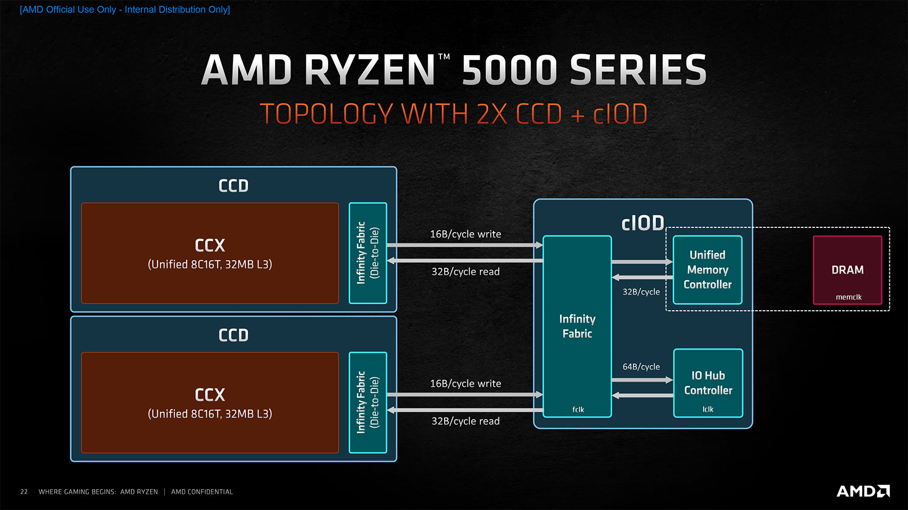

# Saturn Affinity

Program to optimize cache utilization for games on Ryzen CPUs with multiple L3 cache clusters.

The purpose of this program is to optimize the speed of cache-sensitive games, even when background programs are running.

## Download
* [Saturn Affinity Release Link](https://github.com/saturnsky/saturn_affinity_python/releases)

## How it works
1. If a program in the Game List is in the foreground, it is assigned to the cores with access to the largest L3 cache, and all other programs are assigned to the remaining cores.
2. Otherwise, reassign them so that all programs have access to all cores.

## What are the effects of this program?

Zen 3 and Zen 4 have one L3 cache per CCD, and there is no benefit to having L3 caches on different CCDs.

This program allocates the game being played to CCD0 and all other programs to CCD1, which has the effect of making the L3 cache on CCD0 monopolized by the game.

CPUs with more L3 cache capacity for CCD0, such as the Ryzen 9 7950X3D and Ryzen 9 7900X3D, will see a greater effect, but in my testing, for cache-sensitive games, the Ryzen 9 5950X also saw a significant effect.

Older generation Ryzen CPUs (such as the Ryzen 7 2700X), which have two CCXs on a single CCD and cannot benefit from caches from different CCXs, are expected to see a similar effect.

For games that are highly cache-sensitive but weak on multithreading, CPUs with two CCDs and each CCD has two CCXs (such as the Ryzen 9 3950X) may also see performance gains, but many games are expected to experience performance drops due to the quartering of the number of cores allocated.

## Are there any games that shouldn't use this program?
For games that spawn threads based on the number of cores in your CPU, it's possible that performance will suffer. This tool should not be used in such games.

Even if this is not the case, games that can utilize a large number of threads may experience a performance drop on CPUs with fewer cores.

## Caution
I created this program for the 7950X3D, but have not tested it on a real 7950X3D. Therefore, I cannot guarantee its behavior on the 7950X3D.

For example, the Core Affinity feature in the Ryzen chipset driver may conflict with a feature in this program.

## Compatibility
Theoretically, this program should work on CPUs with multiple L3 cache clusters. It is assumed that the larger the L3 cache cluster, the better the effect.

### Tested CPU
- Ryzen 9 5950X (The game exclusively utilizes 8 cores and 32MB of L3 cache)

## Benchmark

### Stellaris
Ryzen 9 5950X, DDR4-3200 128GB, Windows 11 [10.0.22621.1344]

This system is not a clean environment because the operating system has been installed for a very long time, so the effect may be exaggerated compared to a typical PC.

#### Benchmark Settings
- Galaxy Size: Huge (1000)
- Galaxy Shape: Spiral (2 Arms)
- AI Empires: 15
- Advanced AI Stars: 4
- Fallen Empires: 4
- Marauder Empires: 3

#### Benchmark Methods
1. Start the game with the above settings.
2. Save the game.
3. All tests started by loading the game above.
4. Use the human_ai console command.
5. See how many in-game days pass for 5 minutes at fastest speed.
6. Repeat steps 3 to 5 3 times.

#### Before
- 1st: 3112 days
- 2nd: 3118 days
- 3rd: 3113 days

#### After
- 1st: 4696 days
- 2nd: 4662 days
- 3rd: 4695 days

#### Result
50.4% performance improvement.
